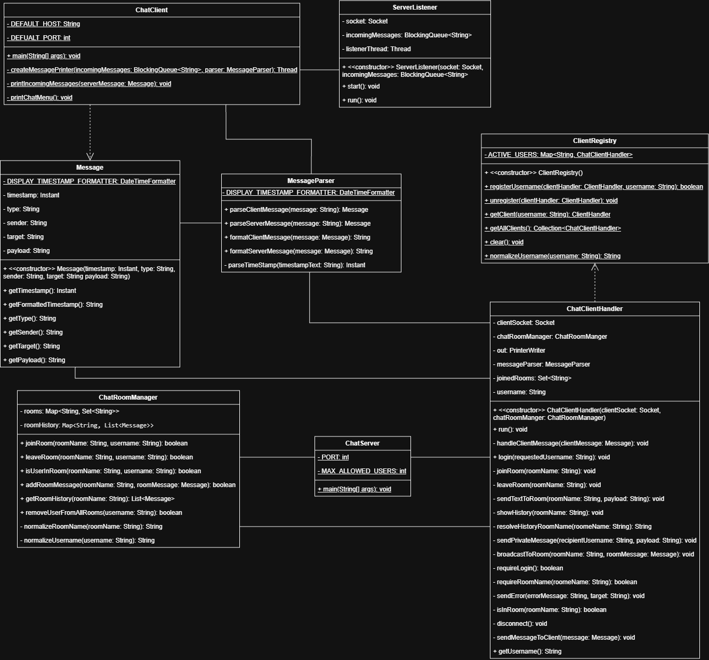
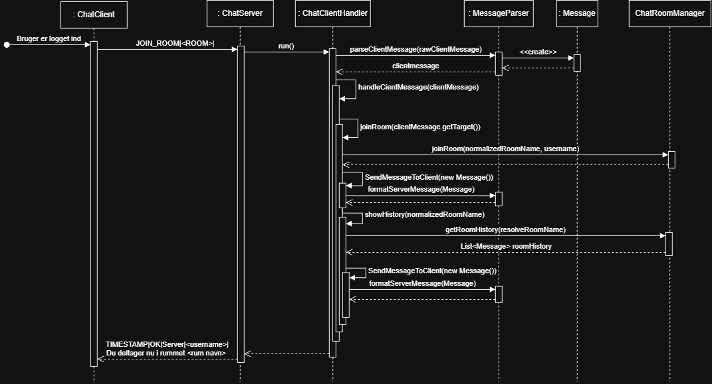

# Chat Program (Java)
> Simpelt konsol-baseret chatprogram, hvor flere klienter kan kommunikere med hinanden via en server.

 
## AI
| Opgave                 | AI-værktøj      | AI’s forslag                                                                                        | Jeres vurdering og ændringer                                                                          | Kontrol og test                                                                                                                                                           |
|------------------------|-----------------|-----------------------------------------------------------------------------------------------------|-------------------------------------------------------------------------------------------------------|---------------------------------------------------------------------------------------------------------------------------------------------------------------------------|
| Issue 15 serverlistner | GitHub Copilot | AI forslog en fin plan                                                                              | Vi vuderet at planen var fin                                                                          | Test var ude mærket. Men da vi kiget i koden var den kommet til at lave en metode i både handleren og i servereen som vi retted og fik en forklaring på, at det var en fejl |
| Mange issues           | GitHub Copilot | AI forsolg en plan som så ude mærket ud men den hadet ikke kigget i de klasser som den skulle bruge | Vi fortalte AI, at den skulle kigge i klaserne for at komme op med en plan som omhandlet vores program | Vi nåret ikke til denne del                                                                                                                                               |
| Udvidelsen             | GitHub Copilot | mangle criditter gjor at vi bruge min ai's plan og bruge den anden ai til at lave planen            | Det gik ude mærket og vi fik en implematation, som vi kunne bruge til at lave vores udvidelse         | Vi testet implementiaionen og det virket                                                                                                                                 |

## Test
| Test                                      | Forventet resultat                                 |
|-------------------------------------------|----------------------------------------------------|
| Tre klienter forbindes samtidig           | Alle 3 klienter kan forbinde                       |
| To brugere vælger samme brugernavn        | Den anden bruger for en fejlbesked                 |
| En bruger sender en besked i et rum       | Kun brugere i det pågældende rum modtager beskeden |
| En bruger sender en privat besked         | Kun den pågældene bruger kan se denne bessked      |
| En klient sender en fejlformateret besked | Serveren sender en fejl og fortsætter med at køre  |
| En klient lukker uventet                  | Serveren fjerner klienten fra samlingen            |
| Bruger joiner et rum                      | Brugern kan se hisorikken fra det rum              |

## Vejledning & protokolbeskrivelse
| Vejledning til start af program                                                                                              |
|------------------------------------------------------------------------------------------------------------------------------|
| 1. Kør serverens main-metode                                                                                                 |
| 2. Hvis porten er i brug skal du  gå in og finde konstanten ved navnet PORT for at ændre naven gør det for serveren og clienten |
| 3. Kør klientens main-metode                                                                                                            |

| Beskrivelse af protokollen                                                                                                                        |
|---------------------------------------------------------------------------------------------------------------------------------------------------|
| Vores protokol heder MessageParsner                                                                                                               |
| Den tager det rå test og om danner det til felter som kan bliver brugt af programmet til at vide hvor ting sker                                   |
| Den forteller hvilken type modtager og din tekst og setter dem ind i felter fx PRIVATE bob hej med dig bob                                        |
| Den forteller også hvad der sker inde i serveren når den snakker med clienten TIMESTAMP SENDER her sender den din besked til bob  fx TIMESTAMP PRIVATE FRANK BOB hej med dig bob |
| Den består primært af 2 scenarier: Klienten bruger et beskedformatet `TYPE \| TARGET \| PAYLOAD` og serveren bruger `TIMESTAMP \| TYPE \| SENDER \| TARGET \| PAYLOAD`|

## Trådmodellen & delte ressourcer
Trådmodell vi bruger den hedder mulitthredding. Den er med til at gøre, at vores program kan køre flere ting på engang, frem for at programmet skal vente på at blive ferdig med en ting.
Dertil, Exceute bliver brugt til at fortelle, at der kun må være et antal af tråde

## Valgte udvidelse
`Lagring og Visning af beskedhistorik (Chatrum)`

Vi har valgt at gå med den der hedder historic fordi vi mener det giver best mening for vores program at starte med, at man også kan se historikken i de rum man joiner og det giver også en bedre oplevelse.
Det vi har udvidet er, at man kan se hvad der er forgået in i et rum når man joiner det er også muligt at bruge komanodoen histork for at gør det samme.
Vi har valideret så en skal være joinet, det rum som han vil se historikken fra og der ikke sker noget hvis rummet er tomt.
Det vi ikke har gjort er, at man ikke kan gør det for private chat da det ikke giver mening, at man kan se hvad der er forgået i en privat chat

### Klassediagram

### Sekvensdiagram
